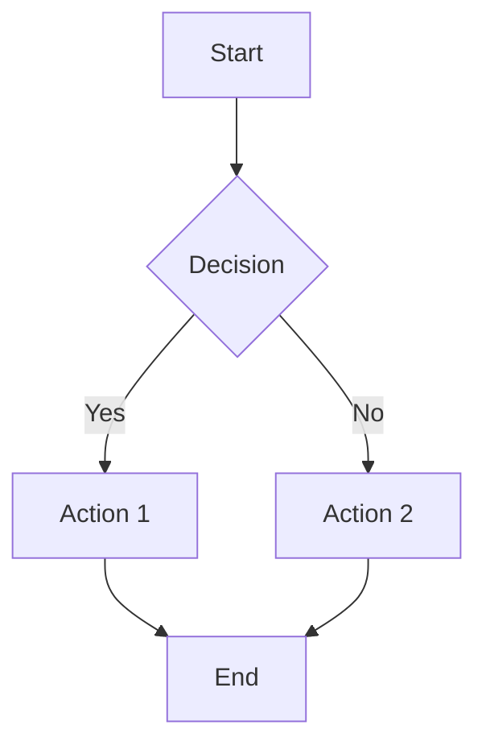

# Contributing to Coding Agent Specs

Thank you for your interest in contributing! This document provides guidelines and instructions for contributing.

## 🌟 Ways to Contribute

- **Report bugs** by opening issues
- **Suggest enhancements** by opening issues
- **Improve documentation** by submitting PRs
- **Add new specifications** by submitting PRs
- **Review pull requests** from other contributors

## 📝 Development Setup

### Prerequisites

- Node.js 18+
- Bun or npm
- Git
- Text editor with Markdown support

### Getting Started

```bash
# Fork the repository on GitHub

# Clone your fork
git clone https://github.com/YOUR_USERNAME/coding-agent-specs.git
cd coding-agent-specs

# Create a branch for your changes
git checkout -b feature/your-feature-name

# Make your changes
# ...

# Commit your changes
git add .
git commit -m "Description of your changes"

# Push to your fork
git push origin feature/your-feature-name

# Open a Pull Request on GitHub
```

## 📋 Contribution Guidelines

### Documentation Standards

#### File Naming

- Use `UPPERCASE.md` for main documents
- Use `kebab-case.md` for guides/tutorials
- Use descriptive names: `TOOL_SYSTEM.md`, not `tools.md`

#### Markdown Style

```markdown
# Document Title

Brief introduction (1-2 paragraphs)

## Section Heading

Content with examples

### Subsection

More details

#### Code Examples

\`\`\`typescript
// Always include language hints
const example = "code"
\`\`\`

#### Lists

- **Bold term**: Description
- Another item
  - Nested item

#### Admonitions

> **Note**: Important information
> 
> Additional context

> **Warning**: Critical information
```

#### Code Examples

Good:
```typescript
// ✅ Complete, runnable example
async function executeTool(
  tool: Tool,
  input: unknown
): Promise<Result> {
  const validated = await validateInput(input)
  return tool.call(validated)
}
```

Bad:
```typescript
// ❌ Incomplete, unclear
function executeTool(tool, input) {
  return tool.call(input)
}
```

### Specification Guidelines

#### Structure

Each spec should include:

1. **Overview** - What is this spec about?
2. **Core Concepts** - Key abstractions and types
3. **API Reference** - Detailed interface definitions
4. **Examples** - Practical usage examples
5. **Best Practices** - Do's and don'ts
6. **Advanced Topics** - Deep dives (optional)
7. **Summary** - Quick reference

#### Code Style

- Use TypeScript for all code examples
- Include type annotations
- Add JSDoc comments for interfaces
- Show error handling
- Include both sync and async variants where applicable

#### Clarity

- Write for developers new to the system
- Define terms on first use
- Link to related specs
- Include diagrams for complex flows

### Types of Contributions

#### 📖 Documentation Improvements

- Fix typos, grammar, clarity
- Add missing examples
- Improve explanations
- Add cross-references

#### 🔧 Specification Updates

- Fix technical inaccuracies
- Update to match implementation
- Add new interfaces/types
- Expand coverage

#### 🆕 New Specifications

Check if the spec exists first. If not:

1. Create an issue proposing the new spec
2. Wait for approval
3. Follow the standard structure
4. Include comprehensive examples

#### 🐛 Bug Reports

Use the issue template:

```markdown
## Description
[Clear description of the issue]

## Steps to Reproduce
1. Step 1
2. Step 2
3. ...

## Expected Behavior
[What you expected]

## Actual Behavior
[What actually happened]

## Additional Context
[Screenshots, logs, etc.]
```

## 🎨 Diagram Guidelines

### Mermaid Diagrams

Use Mermaid for flowcharts and sequences:



### ASCII Diagrams

For simple diagrams:

```
┌─────────────┐
│  Component  │
└──────┬──────┘
       │
       ▼
┌─────────────┐
│   Action    │
└─────────────┘
```

## ✅ Pull Request Process

### Before Submitting

- [ ] Code examples compile (TypeScript)
- [ ] Markdown renders correctly
- [ ] Links are valid
- [ ] Spell check completed
- [ ] Follows documentation standards
- [ ] Added to table of contents if new doc

### PR Template

```markdown
## Description
[What does this PR change?]

## Type of Change
- [ ] Bug fix
- [ ] Documentation improvement
- [ ] New specification
- [ ] Breaking change

## Checklist
- [ ] Follows documentation standards
- [ ] Code examples are correct
- [ ] All links work
- [ ] Spell checked

## Related Issues
Fixes #[issue number]

## Screenshots (if applicable)
[Before/after if relevant]
```

### Review Process

1. **Automated Checks**
   - Markdown lint
   - Link validation
   - Spell check

2. **Peer Review**
   - At least one approval required
   - Address all feedback
   - Keep discussions focused

3. **Merge**
   - Squash commits
   - Use descriptive commit message
   - Update changelog if needed

## 🏆 Recognition

Contributors are recognized in:

- `CONTRIBUTORS.md` file
- Release notes
- Project README

## 📚 Resources

### Learning Resources

- [TypeScript Handbook](https://www.typescriptlang.org/docs/)
- [Markdown Guide](https://www.markdownguide.org/)
- [Mermaid Documentation](https://mermaid-js.github.io/)

### Tools

- **VS Code Extensions**:
  - Markdown All in One
  - markdownlint
  - Mermaid preview

- **Online Tools**:
  - [Mermaid Live Editor](https://mermaid.live/)
  - [Markdown Linter](https://www.markdownlint.com/)

## 💬 Getting Help

- **GitHub Discussions**: For questions and ideas
- **GitHub Issues**: For bugs and features
- **Documentation**: Check existing specs first

## 📜 Code of Conduct

### Our Standards

- Be respectful and inclusive
- Welcome newcomers
- Accept constructive criticism
- Focus on what's best for the community
- Show empathy towards others

### Unacceptable Behavior

- Harassment or discrimination
- Trolling or insulting comments
- Public or private harassment
- Publishing others' private information
- Other unprofessional conduct

### Enforcement

Report issues to: conduct@example.com

## 📄 License

By contributing, you agree that your contributions will be licensed under the MIT License.

---

**Thank you for contributing!** 🎉

Every contribution, no matter how small, helps improve the project for everyone.
